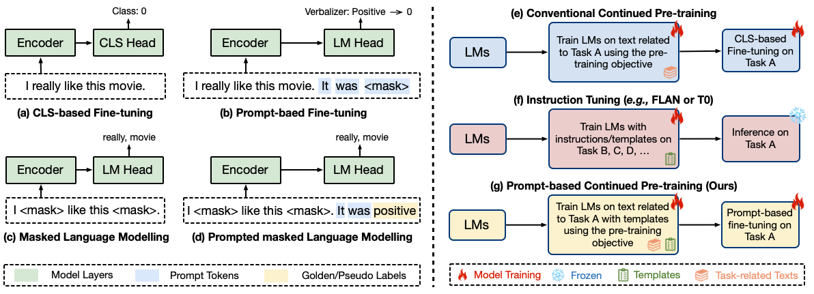

# Don’t Stop Pretraining? Make Prompt-based Fine-tuning Powerful Learner
This repository provides the code for the NeurIPS 2023 (Main Track) paper titled **[Don’t Stop Pretraining? Make Prompt-based Fine-tuning Powerful Learner](https://arxiv.org/pdf/2305.01711.pdf)**, making the integration of our code contributions into other projects more accessible.

<div align="center">

  [](https://arxiv.org/pdf/2305.01711.pdf)
  [](https://pytorch.org/)
  [](https://opensource.org/licenses/MIT)
</div>

- **<span style="color:red;">[:loudspeaker: News - 23 Sep 2023]</span>** Check out our new work **[DePT: Decomposed Prompt Tuning for Parameter-Efficient Fine-tuning](https://arxiv.org/pdf/2309.05173v1.pdf)** and the code at **[DePT](https://github.com/zhengxiangshi/dept)**.
- **<span style="color:red;">[:loudspeaker: News - 21 Sep 2023]</span>** Our paper has been accepted by **[NeurIPS 2023](https://nips.cc/virtual/2023/poster/70285)** at Main Track.


## Our Contributions
* Implementation of the Prompt-based Continued Pre-training (PCP) method, accompanied by easy-to-understand instructions.
* Implementation of the state-of-the-art prompt-based fine-tuning approaches, including hard \[[2](https://aclanthology.org/2021.eacl-main.20/), [3](https://arxiv.org/abs/2012.15723)\] and soft \[[3](https://arxiv.org/abs/2108.13161)\] variants.
* Implementation of self-training methods based on hard prompt-based fine-tuning approaches.

<p align="center">
  </a>
  <br />
</p>

## Quick Links
- [Don’t Stop Pretraining? Make Prompt-based Fine-tuning Powerful Learner](#dont-stop-pretraining-make-prompt-based-fine-tuning-powerful-learner)
  - [Our Contributions](#our-contributions)
  - [Quick Links](#quick-links)
  - [Overview](#overview)
  - [1. Requirements and Installation](#1-requirements-and-installation)
  - [2. Prepare the datasets](#2-prepare-the-datasets)
  - [3. Prompt-based Fine-tuning](#3-prompt-based-fine-tuning)
  - [4. Prompt-based Continued Pre-training (PCP)](#4-prompt-based-continued-pre-training-pcp)
  - [5. Other Baseline Approaches](#5-other-baseline-approaches)
  - [Bugs or questions?](#bugs-or-questions)
  - [Citation](#citation)
  - [Acknowledgement](#acknowledgement)


## Overview
You can reproduce the experiments of our paper [Don’t Stop Pretraining? Make Prompt-based Fine-tuning Powerful Learner](https://arxiv.org/pdf/2305.01711.pdf).

> **Abstract**
>
> Language models (LMs) trained on vast quantities of unlabelled data have greatly advanced the field of natural language processing (NLP). In this study, we re-visit the widely accepted notion in NLP that continued pre-training LMs on task-related texts improves the performance of fine-tuning (FT) in downstream tasks. Through experiments on eight single-sentence tasks and eight sentence-pair tasks in both semi-supervised and fully-supervised settings, we find that conventional continued pre-training does not consistently provide benefits and can even be detrimental for sentence-pair tasks or when prompt-based FT is used. To tackle these issues, we propose Prompt-based Continued Pre-training (PCP), which combines the idea of instruction tuning with conventional continued pre-training. Our approach aims to improve the performance of prompt-based FT by presenting both task-related texts and prompt templates to LMs through unsupervised pre-training objectives before fine-tuning for the target task. Our empirical evaluations on 21 benchmarks demonstrate that the PCP consistently improves the performance of state-of-the-art prompt-based FT approaches (up to 20.1% absolute) in both semi-supervised and fully-supervised settings, even with only hundreds of unlabelled examples. Additionally,prompt-based FT with the PCP outperforms state-of-the- art semi-supervised approaches with greater simplicity, eliminating the need for an iterative process and extra data augmentation. Our further analysis explores the performance lower bound of the PCP and reveals that the advantages of PCP persist across different sizes of models and datasets. 

## 1. Requirements and Installation
To run the prompt-based or cls-based fine-tuning, you need to install the following packages.
- Transformers
- Pytorch

To install the required packages for our baseline approaches (semi-supervised approaches), you can run the following command.
```sh
pip install -r requirements.txt
```

## 2. Prepare the datasets
For our experiments, we utilize two groups of datasets.
- First Group (16 datasets): This group includes single sentence tasks (`SST-2`, `SST-5`, `mr`, `cr`, `mpqa`, `subj`, `trec`, `CoLA`) and sentence pair tasks (`MRPC`, `QQP`, `STS-B`, `MNLI`, `MNLI-mm`, `SNLI`, `QNLI`, `RTE`). These datasets are located in the `data/k-shot` folder. We employ the same data splits as [LM-BFF](https://github.com/princeton-nlp/LM-BFF/tree/main/data). To execute prompt-based fine-tuning with these datasets, set `TASK_TYPE` as `glue` and `TASK_NAME` as the name of the dataset. We set the `MAX_LENGTH` as 128 for single sentence tasks and 256 for sentence pair tasks. The `data/glue_pretrain` our preprocessed txt files for task-adaptive pre-training and json files for generating pseudo labels in prompt-based continued pre-training.
- Second Group (5 datasets): This group consists of `ag_news`, `amazon_review`, `yahoo_answers`, `yelp_review`, `aclImdb`. These datasets are available in the `data` folder. To run prompt-based fine-tuning with these datasets, please set the `TASK_TYPE` as `ssl` and `TASK_NAME` as the name of the dataset. We set the `MAX_LENGTH` as 256 for all these datasets. The `data/${TASK_NAME}/labeled_idx` folder contains the indices of selected labeled examples for five different seeds.

## 3. Prompt-based Fine-tuning
Here we provide the code for prompt-based fine-tuning. Execute the following command to fine-tune the model using the `CHECKPOINT` of the pre-trained models, such as `roberta-large` or the PCP checkpoint. Set up the  `MODEL_TYPE` as `prompting` or `dart`, where `prompting` represents hard prompt-based fine-tuning and `dart` stands for soft prompt-based fine-tuning. For each dataset in the first group, we utilize 16 examples per class. For instance, to perform prompt-based fine-tuning (soft) on the `SST-2` dataset, run the command below.
```bash
TASK_NAME=SST-2
TASK_TYPE=glue
MODEL_TYPE=dart
CHECKPOINT=roberta-large
MAX_LENGTH=128
for lr in 1e-5 2e-5 5e-5; do
    for seed in 13 21 42 87 100; do
        CUDA_VISIBLE_DEVICES=0 python run_prompt_ft.py \
            --task_type ${TASK_TYPE} \
            --model_type ${MODEL_TYPE} \
            --downstream_task_name ${TASK_NAME} \
            --train_file data/k-shot/${TASK_NAME}/16-${seed} \
            --validation_file data/k-shot/${TASK_NAME}/16-${seed} \
            --test_file data/k-shot/${TASK_NAME}/16-${seed} \
            --model_name_or_path ${CHECKPOINT} \
            --do_train \
            --do_eval \
            --do_predict \
            --per_device_train_batch_size 8 \
            --per_device_eval_batch_size 8 \
            --max_seq_length ${MAX_LENGTH} \
            --save_strategy steps \
            --evaluation_strategy steps \
            --max_steps 1000 \
            --eval_steps 100 \
            --save_steps 100 \
            --learning_rate ${lr} \
            --weight_decay 0.01 \
            --warmup_ratio 0.06 \
            --load_best_model_at_end \
            --save_total_limit 1 \
            --output_dir saved_${TASK_TYPE}/${MODEL_TYPE}_${TASK_NAME}_${seed}_${lr};
    done;
done
```
You can use the argument `--run_pseduo_label True` and set the argument `--test_file data/glue_pretrain/${TASK_NAME}` to generate pseudo labels for the training data. This is necessary since we need to use the train and dev set for further continued pre-training, rather than the original test set. Refer to the `sh_examples` folder to view some examples. The generated pseudo labels will be saved in `predict_results_train.json` and `predict_results_dev.json` within the `--output_dir` folder. For details on how to use the generated pseudo labels for prompt-based continued pre-training (PCP), please refer to [4. Prompt-based Continued Pre-training (PCP)](#4-prompt-based-continued-pre-training).

For each dataset in the second group, set the number of labels `LABEL_SIZE` to define the total amount of labeled examples. For instance, to execute prompt-based fine-tuning (hard) on the `aclImdb`  dataset, run the command below.
```bash
TASK_NAME=aclImdb
TASK_TYPE=ssl
MODEL_TYPE=prompting
CHECKPOINT=roberta-large
NUMBER_LABELS=20
MAX_LENGTH=256
for lr in 1e-5 2e-5 5e-5; do
    for seed in 1 2 3 4 5; do
        CUDA_VISIBLE_DEVICES=0 python run_prompt_ft.py \
            --task_type ${TASK_TYPE} \
            --model_type ${MODEL_TYPE} \
            --downstream_task_name ${TASK_NAME} \
            --seed ${seed} \
            --num_labelled_data ${NUMBER_LABELS} \
            --train_file data/${TASK_NAME} \
            --validation_file data/${TASK_NAME} \
            --test_file data/${TASK_NAME} \
            --model_name_or_path ${CHECKPOINT} \
            --do_train \
            --do_eval \
            --do_predict \
            --per_device_train_batch_size 8 \
            --per_device_eval_batch_size 16 \
            --max_seq_length ${MAX_LENGTH} \
            --save_strategy steps \
            --evaluation_strategy steps \
            --max_steps 1000 \
            --eval_steps 100 \
            --save_steps 100 \
            --learning_rate ${lr} \
            --weight_decay 0.01 \
            --warmup_ratio 0.06 \
            --load_best_model_at_end \
            --save_total_limit 1 \
            --output_dir saved_${TASK_TYPE}/${MODEL_TYPE}_${TASK_NAME}_${seed}_${lr}_${NUMBER_LABELS};
    done;
done
```

## 4. Prompt-based Continued Pre-training (PCP)
After obtaining pseudo labels for the training data of a specific task, you can execute the following command to perform prompt-based continued pre-training (PCP). Use the argument `--use_fixed_dart`  for soft prompt-based continued pre-training; otherwise, hard prompt-based continued pre-training will be used.  In hard prompt-based continued pre-training, we utilize human-written templates and labeled words as prompts. For soft prompt-based continued pre-training, we use the same templates for single sentence tasks and sentence pair tasks, respectively. For more details on the differences between soft and hard prompt-based continued pre-training, please refer to the paper. For example, to carry out prompt-based continued pre-training (soft) on single sentence tasks, run the command below.
```bash
MODEL_TYPE=dart
for TASK_NAME in subj sst-5 trec CoLA mr SST-2 cr mpqa; do
    python src/convert_to_pretrain_pcp.py \
        --use_fixed_dart \
        --task_name ${TASK_NAME} \
        --train_file output_path/predict_results_train.json \
        --dev_file output_path/predict_results_dev.json \
        --output_path data/glue_pretrain/${TASK_NAME}_${MODEL_TYPE};
done
```

Once you have acquired the pre-training data, you can execute the following command to perform prompt-based continued pre-training. For instance, to carry out prompt-based continued pre-training using soft and hard templates on single sentence tasks, run the command below.
```bash
for MODEL_TYPE in prompting dart; do
    for TASK_NAME in subj sst-5 trec CoLA mr SST-2 cr mpqa; do
        python run_mlm.py \
            --model_name_or_path roberta-large \
            --train_file data/glue_pretrain/${TASK_NAME}_${MODEL_TYPE}/train.txt \
            --validation_file data/glue_pretrain/${TASK_NAME}_${MODEL_TYPE}/dev.txt \
            --line_by_line \
            --per_device_train_batch_size 16 \
            --per_device_eval_batch_size 16 \
            --gradient_accumulation_steps 8 \
            --learning_rate 1e-04 \
            --optim adamw_torch \
            --weight_decay 0.01 \
            --adam_beta1 0.9 \
            --adam_beta2 0.98 \
            --adam_epsilon 1e-06 \
            --do_train \
            --do_eval \
            --save_steps 500 \
            --evaluation_strategy steps \
            --eval_steps 500 \
            --num_train_epochs 100 \
            --warmup_ratio 0.06 \
            --mlm_probability 0.15 \
            --always_mask_label_token False \
            --fp16 \
            --output_dir saved_checkpoint/${TASK_NAME}_${MODEL_TYPE} \
            --load_best_model_at_end;
    done;
done
```
Remember to adjust the `--per_device_train_batch_size` based on the available GPU memory. When the number of training examples is small, consider using a lower learning rate. After obtaining the pre-trained model, set the `CHECKPOINT` in [3. Prompt-based Fine-tuning](#3-prompt-based-fine-tuning) to the `--output_dir` used in this step. This allows you to perform prompt-based fine-tuning on the task of interest using our PCP checkpoint, which typically outperforms the conventional continued pre-training checkpoint \[[4](https://aclanthology.org/2020.acl-main.740/)\], especially for sentence pair tasks. 

## 5. Other Baseline Approaches
Our repository also includes the implementation of conventional CLS-based fine-tuning, which can be executed using the command below.
```bash
TASK_TYPE=glue
MAX_LENGTH=128
CHECKPOINT=roberta-large
for TASK_NAME in subj sst-5 trec CoLA mr SST-2 cr mpqa; do
    for lr in 1e-5 2e-5 5e-5; do
        for seed in 13 21 42 87 100; do
            CUDA_VISIBLE_DEVICES=0 python run_cls_ft.py \
                --task_type ${TASK_TYPE} \
                --task_name ${TASK_NAME} \
                --train_file data/k-shot/${TASK_NAME}/16-${seed} \
                --validation_file data/k-shot/${TASK_NAME}/16-${seed} \
                --test_file data/k-shot/${TASK_NAME}/16-${seed} \
                --model_name_or_path ${CHECKPOINT} \
                --do_train \
                --do_eval \
                --do_predict \
                --per_device_train_batch_size 8 \
                --per_device_eval_batch_size 8 \
                --max_seq_length ${MAX_LENGTH} \
                --save_strategy steps \
                --evaluation_strategy steps \
                --max_steps 1000 \
                --eval_steps 100 \
                --save_steps 100 \
                --learning_rate ${lr} \
                --weight_decay 0.01 \
                --warmup_ratio 0.06 \
                --load_best_model_at_end \
                --save_total_limit 1 \
                --output_dir saved_${TASK_TYPE}_cls/${TASK_NAME}_${seed}_${lr};
        done;
    done;
done
```

Additionally, we support four self-training approaches, including `adamatch`, `flexmatch`, `fixmatch`, and `dash`. To run self-training, execute the command provided below.
```bash
TASK_NAME=aclImdb
LABEL_SIZE=20
CHECKPOINT=roberta-large
for ALGORITHM in adamatch flexmatch fixmatch dash; do
    for lr in 1e-5 2e-5 5e-5; do
        for seed in 1 2 3 4 5; do \
            CUDA_VISIBLE_DEVICES=0 python run_st.py \
                --seed ${seed} \
                --num_labels ${LABEL_SIZE} \
                --dataset ${TASK_NAME}  \
                --batch_size 8 \
                --eval_batch_size 8 \
                --num_train_iter 25600 \
                --num_eval_iter 2560 \
                --epoch 10 \
                --lr ${lr} \
                --use_pretrain True \
                --pretrain_path ${CHECKPOINT} \
                --net roberta_for_prompting_classification \
                --c config_roberta/${ALGORITHM}/${ALGORITHM}_${TASK_NAME}_${LABEL_SIZE}_0.yaml \
                --save_dir saved_st \
                --save_name output_path \
                --load_path saved_st/output_path/latest_model.pth; \
        done;
    done;
done
```

## Bugs or questions?
If you have any questions regarding the code or the paper, please feel free to reach out to Zhengxiang at `zhengxiang.shi.19@ucl.ac.uk`.  If you experience any difficulties while using the code or need to report a bug, feel free to open an issue. We kindly ask that you provide detailed information about the problem to help us provide effective support.

## Citation
```
@inproceedings{shi2023dont,
title={Don't Stop Pretraining? Make Prompt-based Fine-tuning Powerful Learner},
author={Shi, Zhengxiang and Lipani, Aldo},
booktitle={Thirty-seventh Conference on Neural Information Processing Systems},
year={2023},
url={https://openreview.net/forum?id=s7xWeJQACI}
}
```

## Acknowledgement
This repository is built upon the following repositories:
- [Huggingface Transformers](https://github.com/huggingface/transformers)
- [PET/iPET](https://github.com/timoschick/pet)
- [LM-BFF](https://github.com/princeton-nlp/LM-BFF)
- [pretraining-or-self-training](https://github.com/amzn/pretraining-or-self-training)
- [Semi-supervised-learning](https://github.com/microsoft/Semi-supervised-learning)
